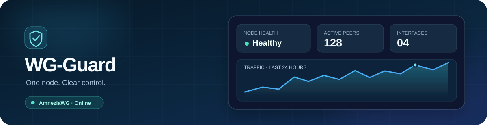

<div align="center">
  <a href="https://github.com/Sir-Adnan/wg-guard"></a>
  <h1>WG-Guard</h1>
  <p><strong>A considered control panel for your AmneziaWG node.</strong></p>
  <p>One Go binary · SQLite · Server-rendered UI · Docker or native · REST API</p>
  <p><strong>English</strong> · <a href="README.fa.md">فارسی</a></p>
  <p>
    
    
    
    
  </p>
</div>

WG-Guard brings the daily work of running a VPN node into one responsive, bilingual panel.
It stays small and direct: Go, SQLite, server-rendered HTML, HTMX, and focused JavaScript.
The VPN data plane stays on the host; the panel organizes access, delivery, diagnostics, and
recovery without turning the server into a large application stack.

| | Built for operators |
|---|---|
| 🛡️ | **AmneziaWG control** — interfaces, generated anti-DPI profiles, peers, and guarded host reconciliation |
| 👥 | **Subscriber lifecycle** — optional technical templates, quota top-ups, expiry, first-use activation, devices, speed limits, Reset Usage, queued Next Plan, and secure subscription-link replacement |
| 📱 | **Client delivery** — per-device configs and QR codes, bulk downloads, and a simple public subscription page |
| 📈 | **A useful overview** — node/AWG health, CPU, memory, disk, live rates, traffic history, alerts, and diagnostics |
| 🔐 | **Safe operations** — owner/reseller permissions, scoped API tokens, signed webhooks, encrypted backups, updates, rollback, and owned removal |
| 🌐 | **A polished panel** — English/Persian, RTL/LTR, light/dark/system modes, ten optional visual presets, desktop and mobile |

### Install

**Production-verified target:** Ubuntu 24.04 LTS on amd64, with root or sudo access and a
reachable VPN endpoint. Docker is the recommended mode; native systemd is also verified.
The installer checks and can provision its catalogued prerequisites. Keep access to the
server's console or SSH during setup, and choose a domain if you want managed domain HTTPS.

```bash
bash -o pipefail -c 'curl -fsSL https://raw.githubusercontent.com/Sir-Adnan/wg-guard/main/install.sh | bash'
```

This fetches the current entry script and installs the **latest published stable release**;
it does not install the development `main` build. The English-language setup guides you
through Docker or native deployment, administrator account, and HTTPS or private access.
It verifies the release asset before installing. The manager survives an interrupted setup,
so a retry can start from `sudo wg-guard`.

| Your goal | Use |
|---|---|
| **Latest stable, guided** | Run the command above; choose Docker (recommended) or native in the menu. |
| **Inspect before running** | Download and read the script with the commands below, then run it locally. |
| **Exact release or development commit** | Select a tag or full SHA explicitly; see the [installation guide](docs/operations/github-install.md). |
| **Unattended setup** | Forward install flags and supply a protected owner-password file; see the [terminal guide](docs/operations/terminal-management.md). |

| Panel access | When to choose it |
|---|---|
| **Private SSH tunnel** | No domain is ready; the panel stays on loopback and is not exposed publicly. |
| **Managed HTTPS** | A domain or supported public-IP certificate is available. The installer handles the owned TLS path. |
| **Existing reverse proxy** | You already operate Nginx or another HTTPS proxy; use the documented coexistence flow. |

To inspect the entry script before running it:

```bash
curl -fsSLo wg-guard-install.sh \
  https://raw.githubusercontent.com/Sir-Adnan/wg-guard/main/install.sh
less wg-guard-install.sh
bash wg-guard-install.sh
```

For a **native** installation, run `bash wg-guard-install.sh -- --mode native` instead.
The [installation guide](docs/operations/github-install.md) gives copyable commands for
latest and exact releases, Docker/native, development builds and unattended setup, plus
prerequisites and integrity details.

### First steps in the panel

1. Check the dashboard and `sudo wg-guard doctor` for a healthy node.
2. Create an interface and choose a plain or compatible AmneziaWG profile.
3. Add a user; use a template only when you want shared technical defaults. A connected owner bot can supply direct entitlement terms and keep its products and prices outside WG-Guard.
4. Create or review the device, then share its QR code, config, or subscription link.

Replacing a subscription link also replaces its device credentials so previously issued
links and configs stop working. Review client compatibility before changing a live profile.

### Run

```bash
sudo wg-guard             # management menu
sudo wg-guard status      # service and deployment
sudo wg-guard doctor      # host and tunnel diagnostics
sudo wg-guard logs        # bounded operational logs
sudo wg-guard update      # reviewed panel/core lifecycle
```

The menu covers encrypted backups, restore review, schedules, rollback, access changes, and
uninstall. Take a backup before moving the panel to a new server; restore checks the target
environment and retains the database/master-key relationship. See the
[recovery guide](docs/operations/backup-restore.md).

Generated AmneziaWG profiles require compatible clients; plain profiles can use standard
WireGuard clients. Active firewalld, newer Ubuntu releases, non-amd64 hosts, and 1000
simultaneous handshakes are outside the current production claim. The exact verified cells
and limits are in [project status](docs/development/status.md).

### API and design

The same node exposes a documented `/api/v1` for external systems. An atomic purchase creates
a user, device and customer link; quota top-ups also return a recoverable before/after result.
Reseller tokens remain in their own customer namespace. Cursor pagination, scoped delivery
receipts and signed webhooks support
integration without screen-scraping. The web panel remains server-rendered, and the host owns
tunnel interfaces, firewall rules, and shaping. Start with the [API contract](docs/architecture/api.md) or
[architecture overview](docs/architecture/overview.md).

### Explore

[Installation](docs/operations/github-install.md) ·
[Deployment and HTTPS](docs/operations/deployment.md) ·
[Client compatibility](docs/integrations/amneziawg.md) ·
[REST API](docs/architecture/api.md) ·
[Documentation map](docs/README.md)

The [latest release bundle](https://github.com/Sir-Adnan/wg-guard/releases/latest) includes
the Linux/amd64 binary, checksums, dependency inventory, and notices. You can verify the
downloaded files with `sha256sum --check --ignore-missing checksums.txt`. WG-Guard is
[MIT-licensed](LICENSE); external components and their licenses are listed in
[THIRD_PARTY.md](THIRD_PARTY.md). Contributions start with [AGENTS.md](AGENTS.md).
